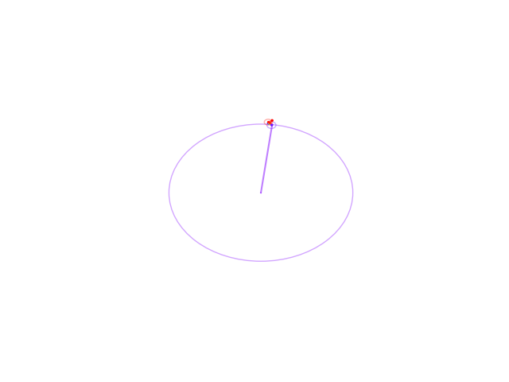
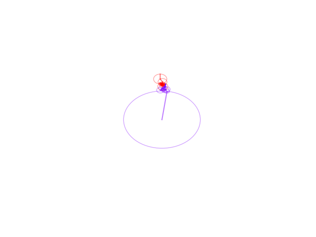
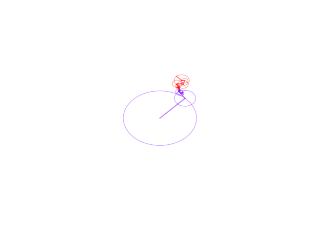
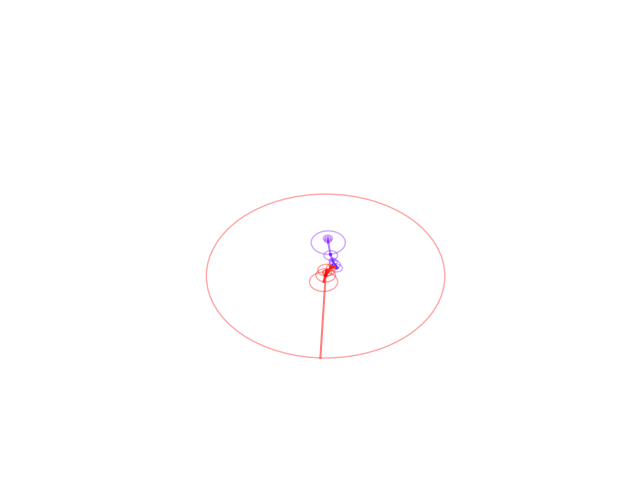
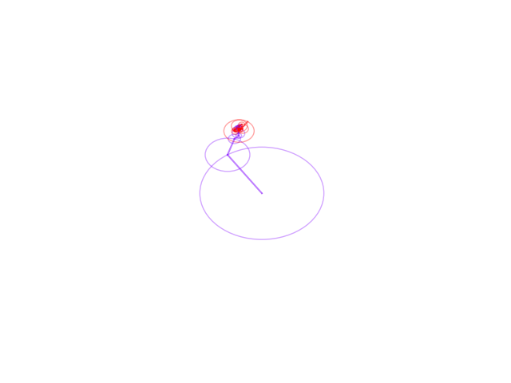
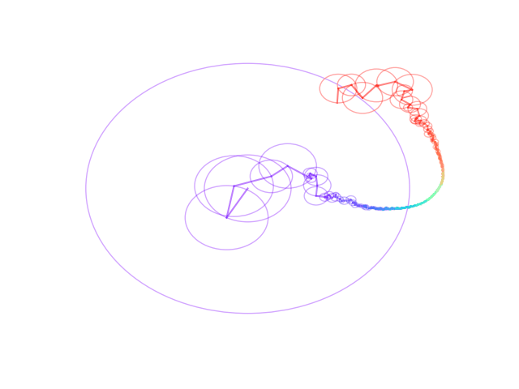
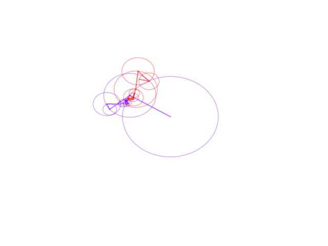

# Fourier Series Drawing

Animated drawing of image outlines using the Complex Fourier Series — implemented in Python with NumPy, SciPy, and matplotlib.

## Tech Stack

| Category | Libraries |
|---|---|
| **Numerical** | `numpy`, `scipy` (FFT) |
| **Visualization** | `matplotlib` (animation), `pillow` |
| **Image Processing** | `opencv-python` (contour extraction) |
| **SVG** | `svg-path`, `svgwrite` |
| **Package Manager** | `uv` |

## Overview

The pipeline converts an image outline into discrete complex points, applies the Discrete Fourier Transform (via FFT), and reconstructs the shape by summing the Fourier series — drawing circles that rotate at each frequency component.

Two approaches exist in this repo:

### New (`src/`) — modular, FFT-based, raster + SVG support

- `src/draw_with_circle.py` — Core `DrawWithCircles` class
- `src/png_to_discrete.py` — Extract contour from PNG/JPG via OpenCV
- `src/utils.py` — Shared helpers (`ComplexPoint`, SVG parsing, sampling)
- `main.py` — Entry point

```python
from src.draw_with_circle import DrawWithCircles
dwc = DrawWithCircles("./images_to_try/gear.jpg", 300)
dwc.draw()
```

Supports both SVG files and raster images (PNG/JPG). Uses `scipy.fft.fft` for O(N log N) performance and `FuncAnimation` + `PillowWriter` to export animated GIFs.

### Old (`components.py`) — monolithic, O(N²) DFT, SVG-only

Legacy single-file implementation with a naive double-loop DFT and interactive `plt.pause()` animation.

## Examples

| Gear | Iron Man |
|---|---|
|  |  |

| Batman | Maple Leaf |
|---|---|
|  |  |

| Iron Man Head | Gripper |
|---|---|
|  |  |

| Pieeee |
|---|
|  |

## Usage

```bash
uv run main.py
```

To try different images, change the path and point count in `main.py`:

```python
dwc = DrawWithCircles("./images_to_try/<your_image>", n_points=300)
```
